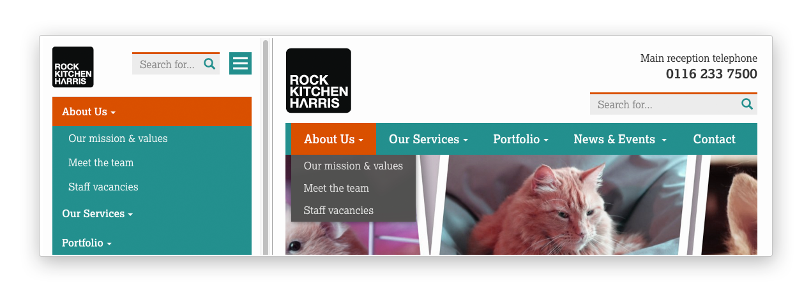

.. _menupage_and_menupagemixin:

=============================================
The ``MenuPage`` and ``MenuPageMixin`` models
=============================================

The ``MenuPageMixin`` and ``MenuPage`` models were created specifically to solve the problem of important page links becoming merely toggles in multi-level menus, preventing users from accessing them easily.

.. contents::
    :local:
    :depth: 1

A typical scenario
==================

Let's say you have an **About Us** section on your site. The top-level "About Us" page has content on it that is just as important as it's children (e.g. "Meet the team", "Our mission and values", "Staff vacancies"). Because of this, you'd like visitors to be able to access the root page as easily as those pages. But, your site uses some form of collapsible multi-level navigation, and the **About Us** page link has become merely a toggle for hiding and showing its sub-pages, making it difficult to get to directly:

``MenuPage`` to the rescue!
---------------------------

If the **About Us** page uses a model that subclasses ``MenuPage`` or ``MenuPageMixin``, you can solve this issue by doing the following:

1.  Edit the page via the CMS, and click on the "Settings" tab.

2.  Uncollapse the "ADVANCED MENU BEHAVIOUR" panel by clicking the
    downward-pointing arrow next to the panel's label

    .. image:: _static/images/wagtailmenus-menupage-settings-collapsed.png
        :alt: Screenshot showing the collapsed 'advanced menu behaviour' panel in the editor interface
    
3.  Tick the **Repeat in sub-navigation** checkbox that appears, and publish
    your changes. 

    .. image:: _static/images/wagtailmenus-menupage-settings-visible.png
        :alt: Screenshot show the expanded 'advanced menu behaviour' panel

Now, wherever the children of the **About Us** page are output (using one of the above menu tags), an additional link will appear alongside them, allowing that page to be accessed more easily. In the example above, you'll see **"Section overview"** has been added to the **Repeated item link text** field. With this set, the link text for the repeated item should read **"Section overview"**, instead of just repeating the page's title, like so:

.. image:: _static/images/repeating-item.png
    :alt: Screenshot showing the repeated nav item appearing in a rendered menu

The menu tags do some extra work to ensure both links are never assigned the 'active' class. When on the 'About Us' page, the tags will treat the repeated item as the 'active' page, and just assign the 'ancestor' class to the original, so that the styling is consistent with other page links rendered at that level.

.. _implementing_menupage:

Implementing ``MenuPage`` into your project
=========================================== 

1.  Subclass ``wagtailmenus.models.MenuPage`` on your model instead of the
    usual ``wagtail.wagtacore.models.Page``, just like in the following
    example: 

    .. code-block:: python
        
        # appname/models.py

        from wagtailmenus.models import MenuPage

        class GenericPage(MenuPage):
            """
            This model will gain the fields, methods and 'setting_panels' attribute
            from MenuPage.
            """
            ...

    Or, if you're using an abstract 'base' model in you project to improve consistency of common functionality, you could update the base model, like so:

    .. code-block:: python
        
        # appname/models.py

        from wagtailmenus.models import MenuPage

        class BaseProjectPage(MenuPage):
            ...

        class GenericPage(BaseProjectPage):
            ...

        class ContactPage(BaseProjectPage):
            ...

2.  If you're not overriding the ``settings_panels`` attribute on any of the
    models involved, you can skip this step. But, if you are overriding the
    ``settings_panels`` attribute on a custom model to surface other custom
    fields in that tab, you'll need to include additional panels to surface the
    new ``MenuPage`` fields in the page editor interface. Wagtailmenus includes a pre-defined ``menupage_panel`` to make this easier, which you can use like
    this:

    .. code-block:: python
        
        # appname/models.py

        from wagtailmenus.models import MenuPage
        from wagtailmenus.panels import menupage_panel

        class GenericPage(MenuPage):
            """
            This model will gain the fields, methods and `setting_panels` attribute
            from `MenuPage`, but `settings_panels` is being overridden to include
            other fields in the `Settings` tab.
            """

            custom_settings_field_one = BooleanField(default=False)
            custom_settings_field_two = BooleanField(default=True)

            # 'menupage_panel' is a collapsible `MultiFieldPanel` with the important
            # fields already grouped together, making it easy to include in custom
            # panel definitions, like so:
            settings_panels = [
                FieldPanel('custom_settings_field_one'),
                FieldPanel('custom_settings_field_two'),
                menupage_panel
            ]
            ...

3.  Create migrations for any models you've updated by running:
    
    .. code-block:: console

        python manage.py makemigrations appname

4.  Apply the new migrations by running:

    .. code-block:: console

        python manage.py migrate appname

.. _implementing_menupagemixin:

Implementing ``MenuPageMixin`` into your project
================================================

Wagtail has a restriction that forbids models from subclassing more than one other class derived from ``Page``, and that single page-derived class must be the left-most item when subclassing more than one model class. Most of the time, that doesn't cause any noticeable issues. But, in some cases, it can make it difficult to swap out base model classes used for page models. In these cases, you can use ``wagtailmenus.models.MenuPageMixin`` instead of ``MenuPage``. 

.. NOTE::
    ``MenuPageMixin`` doesn't change make any changes to the panel configuration on your model that would cause it's new fields to be surfaced in the page editing interface. If you want those fields to appear, you'll have to override ``settings_panels`` on your model to include ``menupage_panel``

1.   Subclass ``wagtailmenus.models.MenuPageMixin`` to create your model, including it to the right of any other class that subclasses ``Page``: 

    .. code-block:: python
        
        # appname/models.py

        from wagtail.contrib.forms.models import AbstractEmailForm
        from wagtailmenus.models import MenuPageMixin
        from wagtailmenus.panels import menupage_panel

        class MyEmailFormPage(AbstractEmailForm, MenuPageMixin):
            """This page will gain the same fields and methods as if it extended
            `wagtailmenus.models.MenuPage`"""

            ...

            # It's not possible for MenuPageMixin to set `settings_panel`, so you must
            # override `settings_panels` yourself, and include `menupage_panel` in
            # order to surface additional fields in the 'Settings' tab of the editor
            # interface
            settings_panels = [
                FieldPanel('custom_settings_field_one'),
                FieldPanel('custom_settings_field_two'),
                menupage_panel
            ]
            ...

2.   Create migrations for any models you've updated by running:
    
    .. code-block:: console

        python manage.py makemigrations appname

3.   Apply the new migrations by running:

    .. code-block:: console

        python manage.py migrate appname

.. _manipulating_submenu_items:

Using ``MenuPage`` to manipulate sub-menu items
===============================================

When a page model subclasses ``MenuPage`` or ``MenuPageMixin``, pages of that type are given special treatment by the menu generation template tags included in wagtailmenus, allowing them to make changes to the sub-menu items that get rendered below them.

The functionality exists to allow ``MenuPage`` pages to add repeating links to themselves into a sub-menu, but can be extended to meet any custom needs you might have. 

For example, if you had a ``ContactPage`` model, and in main menus, you wanted to add some additional links below each ``ContactPage``,  you could achieve that by overriding the ``modify_submenu_items()`` and ``has_submenu_items()`` methods like so:

.. code-block:: python
    
    # appname/models.py

    from wagtailmenus.models import MenuPage

    class ContactPage(MenuPage):
        ...
        
        current_page, current_ancestor_ids, 
        current_site, allow_repeating_parents, apply_active_classes,
        original_menu_tag, menu_instance, request, use_absolute_page_urls

        def modify_submenu_items(self, menu_items, **kwargs):
            """
            If rendering a 'main_menu', add some additional menu items to the end
            of the list that link to various anchored sections on the same page.

            We're only making use 'original_menu_tag' and 'current_site' in this 
            example, but `kwargs` should have all of the following keys:

            * 'current_page'
            * 'current_ancestor_ids'
            * 'current_site'
            * 'allow_repeating_parents'
            * 'apply_active_classes'
            * 'original_menu_tag'
            * 'menu_instance'
            * 'request'
            * 'use_absolute_page_urls'
            """

            # Start by applying default modifications
            menu_items = super(ContactPage, self).modify_submenu_items(menu_items, **kwargs)

            if kwargs['original_menu_tag'] == 'main_menu':
                base_url = self.relative_url(kwargs['current_site'])
                """
                Additional menu items can be objects with the necessary attributes,
                or simple dictionaries. `href` is used for the link URL, and `text`
                is the text displayed for each link. Below, I've also used
                `active_class` to add some additional CSS classes to these items,
                so that I can target them with additional CSS  
                """
                menu_items.extend((
                    {
                        'text': 'Get support',
                        'href': base_url + '#support',
                        'active_class': 'support',
                    },
                    {
                        'text': 'Speak to someone',
                        'href': base_url + '#call',
                        'active_class': 'call',
                    },
                    {
                        'text': 'Map & directions',
                        'href': base_url + '#map',
                        'active_class': 'map',
                    },
                ))
            return menu_items

        def has_submenu_items(self, **kwargs):
            """
            Because `modify_submenu_items` is being used to add additional menu
            items, we need to indicate in menu templates that `ContactPage` objects
            do have submenu items in main menus, even if they don't have children
            pages.

            We're only making use 'original_menu_tag' in this example, but 
            `kwargs` should have all of the following keys:

            * 'current_page'
            * 'allow_repeating_parents'
            * 'original_menu_tag'
            * 'menu_instance'
            * 'request'
            """

            if kwargs['original_menu_tag'] == 'main_menu':
                return True
            # Resort to default behaviour
            return super(ContactPage, self).has_submenu_items(**kwargs)

The above changes would result in the following HTML output when rendering a ``ContactPage`` instance in a main menu:

.. code-block:: html

    ...
    <li class=" dropdown">
        <a href="/contact-us/" class="dropdown-toggle" id="ddtoggle_18" data-toggle="dropdown" aria-haspopup="true" aria-expanded="false">Contact us </a>
        <ul class="dropdown-menu" aria-labelledby="ddtoggle_18">
            <li class="support"><a href="/contact-us/#support">Get support</a></li>
            <li class="call"><a href="/contact-us/#call">Speak to someone</a></li>
            <li class="map"><a href="/contact-us/#map">Map &amp; directions</a></li>
        </ul>
    </li>
    ...

You can also modify sub-menu items based on field values for specific instances, rather than doing the same for every page of the same type. Here's another example:

.. code-block:: python
    
    # appname/models.py

    from django.db import models
    from wagtailmenus.models import MenuPage

    class SectionRootPage(MenuPage):
        add_submenu_item_for_news = models.BooleanField(default=False)

        def modify_submenu_items(
            self, menu_items, current_page, current_ancestor_ids, current_site,
            allow_repeating_parents, apply_active_classes, original_menu_tag='',
            menu_instance, request, use_absolute_page_urls
        ):
            menu_items = super(SectionRootPage,self).modify_menu_items(
                menu_items, current_page, current_ancestor_ids, 
                current_site, allow_repeating_parents, apply_active_classes,
                original_menu_tag, menu_instance, request, use_absolute_page_urls)
            
            if self.add_submenu_item_for_news:
                menu_items.append({
                    'href': '/news/',
                    'text': 'Read the news',
                    'active_class': 'news-link',
                })
            return menu_items

        def has_submenu_items(
            self, current_page, allow_repeating_parents, original_menu_tag,
            menu_instance, request
        ):
            
            if self.add_submenu_item_for_news:
                return True
            return super(SectionRootPage, self).has_submenu_items(
                current_page, allow_repeating_parents, original_menu_tag,
                menu_instance, request)

.. NOTE:: 
    If you're overriding ``modify_submenu_items()``, please ensure that 'repeated menu items' are still added as the first item in the returned ``menu_items`` list. If not, active class highlighting might not work as expected.
